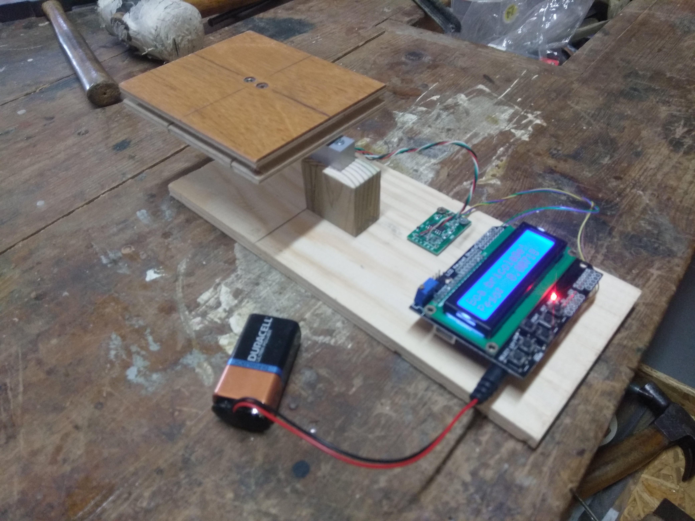
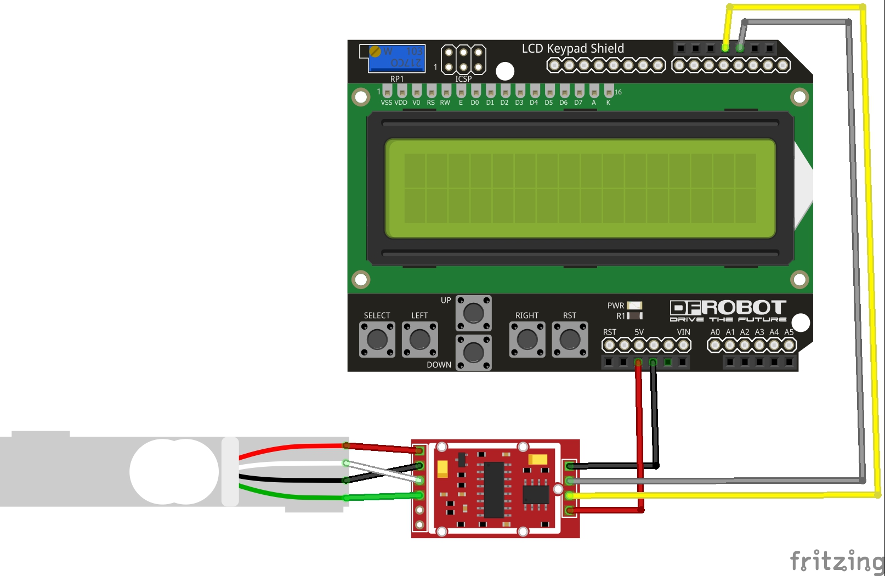

# Arduino-Scale-LCD
This is an easy arduino scale, with a display using the LCD keypad shield.

My build is the simple setup you can see below. This is an Arduino Scale, with a 1kg range and is accurate to ±0.01 grams. Using the buttons on the keypad, a tare option is available.

You can buy these components from Amazon, eBay, Alibaba, Banggood, etc. Below are the links to the parts:
  - Arduino UNO (£8.99): https://www.amazon.co.uk/ELEGOO-Board-ATmega328P-ATMEGA16U2-Cable/dp/B01EWOE0UU/ref=sr_1_3?dchild=1&keywords=arduino+uno&qid=1587762318&sr=8-3
  - LCD Keypad Shield (£7.99): https://www.amazon.co.uk/HALJIA-Display-Keyboard-Arduino-MEGA2560/dp/B06XDNY7FY/ref=sr_1_4?dchild=1&keywords=arduino+lcd+keypad&qid=1587762352&sr=8-4
  - 1kg Load Cell and HX711 module (£6.99): https://www.amazon.co.uk/ARCELI-Converter-Breakout-Portable-Electronic/dp/B07MY35F92/ref=sr_1_3?dchild=1&keywords=arduino+1kg+load+scale&qid=1587762499&sr=8-3
  
Below is the wiring for this project:

Arduino Pin 2 -> HX711 Dout
Arduino Pin 3 -> HX711 Ck
Arduino 5V    -> HX711 Vcc
Arduino Gnd   -> HX711 Gnd

HX711 A+ -> Load Cell Red
HX711 A- -> Load Cell Black
HX711 E+ -> Load Cell White
HX711 E- -> Load Cell Green

Calibration, libraries, tutorials
